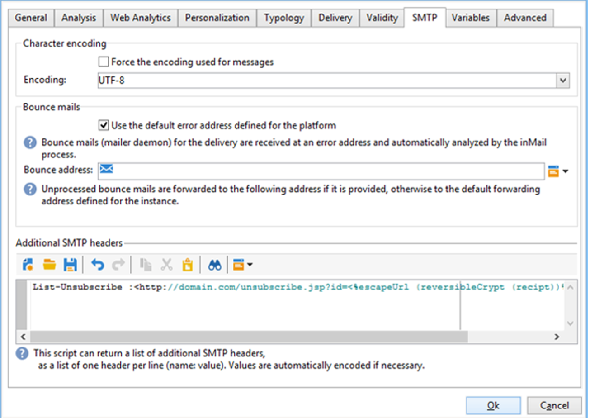
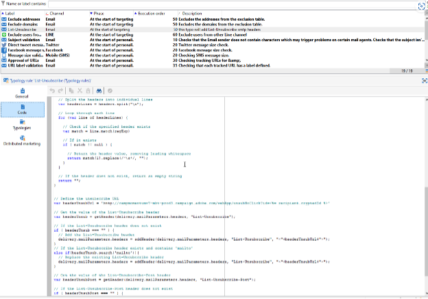
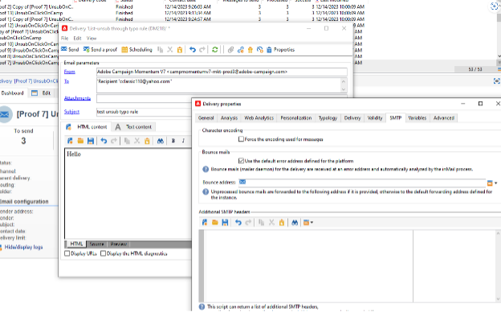

# Campaign Classic: recomendaciones técnicas {#technical-recommendations}

A continuación se enumeran varias técnicas, configuraciones y herramientas que puede utilizar para mejorar la tasa de entrega al utilizar Adobe Campaign Classic.

## Configuración {#configuration}

### DNS inverso {#reverse-dns}

Adobe Campaign comprueba si se ha proporcionado un DNS inverso para una dirección IP y que este señala correctamente a la dirección IP.

Un punto importante de la configuración de red es garantizar que se haya definido un DNS inverso correcto para cada una de las direcciones IP de los mensajes salientes. Esto significa que para una dirección IP determinada, existe un registro DNS inverso (registro PTR) con un bucle DNS (registro A) que corresponde con la dirección IP inicial.

La elección de dominio del DNS inverso influye al tratar con determinados ISP. AOL, en particular, solo acepta bucles de comentarios con una dirección del mismo dominio que el DNS inverso (consulte [Bucle de comentarios](#feedback-loop)).

>[!NOTE]
>
>Puede utilizar [esta herramienta externa](https://mxtoolbox.com/SuperTool.aspx) para comprobar la configuración de un dominio.

### Reglas MX {#mx-rules}

Las reglas MX (Mail eXchanger) son las reglas que administran la comunicación entre un servidor emisor y un servidor receptor.

Más concretamente, se utilizan para controlar la velocidad a la que el MTA de Adobe Campaign (Agente de transferencia de mensajes) envía correos electrónicos a cada dominio de correo electrónico o ISP individual (por ejemplo, hotmail.com, comcast.net). Estas reglas generalmente se basan en los límites publicados por los ISP (por ejemplo, no incluir más de 20 mensajes por cada conexión SMTP).

>[!NOTE]
>
>Para obtener más información sobre la administración de MX en Adobe Campaign Classic, consulte [esta sección](https://experienceleague.adobe.com/docs/campaign-classic/using/installing-campaign-classic/additional-configurations/email-deliverability.html#mx-configuration).

### TLS {#tls}

TLS (Transport Layer Security) es un protocolo de codificación que se puede utilizar para asegurar la conexión entre dos servidores de correo electrónico y proteger el contenido de un correo electrónico evitar que lo lean destinatarios no previstos.

### Dominio del remitente {#sender-domain}

Para definir el dominio utilizado para el comando HELO, edite el archivo de configuración de la instancia (conf/config-instance.xml) y defina un atributo &quot;localDomain&quot; de la siguiente manera:

```
<serverConf>
  <shared>
    <dnsConfig localDomain="mydomain.net"/>
  </shared>
</serverConf>
```

El dominio MAIL FROM es el dominio utilizado en los mensajes de devolución técnicos. Esta dirección se define en el asistente de implementación o a través de la opción NmsEmail_DefaultErrorAddress.

### registro SPF {#dns-configuration}

Actualmente, un registro SPF se puede definir en un servidor DNS como un registro de tipo TXT (código 16) o un registro de tipo SPF (código 99). Un registro SPF toma la forma de una cadena de caracteres. Por ejemplo:

```
v=spf1 ip4:12.34.56.78/32 ip4:12.34.56.79/32 ~all
```

define las dos direcciones IP, 12.34.56.78 y 12.34.56.79, como autorizadas para enviar correos electrónicos para el dominio. **~todos** significa que cualquier otra dirección debe interpretarse como SoftFail.

Recommendations para definir un registro SPF:

* Añadir **~todos** (SoftFail) o **-all** (Fallo) al final para rechazar todos los servidores que no sean los definidos. Sin esto, los servidores podrán forjar este dominio (con una evaluación Neutral).
* No añadir **ptr** (openspf.org recomienda evitar esto por ser costoso y poco fiable).

>[!NOTE]
>
>Obtenga más información sobre el SPF en [esta sección](/help/additional-resources/authentication.md#spf).

## Autenticación

>[!NOTE]
>
>Obtenga más información sobre las distintas formas de autenticación por correo electrónico en [esta sección](/help/additional-resources/authentication.md).

### DKIM {#dkim-acc}

>[!NOTE]
>
>Para instalaciones hospedadas o híbridas, si ha actualizado al [servidor de correo mejorado](https://experienceleague.adobe.com/docs/campaign-classic/using/sending-messages/sending-emails/sending-an-email/sending-with-enhanced-mta.html#sending-messages), este crea la firma de autenticación de correo electrónico DKIM para todos los mensajes con todos los dominios.

Uso de [DKIM](/help/additional-resources/authentication.md#dkim) con Adobe Campaign Classic requiere el siguiente requisito previo:

**declaración de opción de Adobe Campaign**: en Adobe Campaign, la clave privada DKIM se basa en un selector DKIM y un dominio. Actualmente no es posible crear múltiples claves privadas para el mismo dominio/subdominio con distintos selectores. No se puede definir qué dominio/subdominio de selector se debe utilizar para la autenticación en ninguna plataforma o en el correo electrónico. La plataforma selecciona una de las claves privadas, lo que significa que la autenticación tiene una mayor probabilidad de fallo.

* Si ha configurado DomainKeys para la instancia de Adobe Campaign, solo debe seleccionar **dkim** en las [Reglas de administración de dominios](https://experienceleague.adobe.com/docs/campaign-classic/using/sending-messages/monitoring-deliveries/understanding-delivery-failures.html#email-management-rules). Si no es así, siga los mismos pasos de configuración (clave privada/pública) que para DomainKeys (que reemplazó a DKIM).
* No es necesario activar DomainKeys y DKIM para el mismo dominio, ya que DKIM es una versión mejorada de DomainKeys.
* Los siguientes dominios actualmente validan DKIM: AOL, Gmail.

## Bucle de comentarios {#feedback-loop-acc}

Un bucle de comentarios funciona declarando al nivel del ISP una dirección de correo electrónico determinada para un rango de direcciones IP utilizadas para enviar mensajes. El ISP se envía a este buzón de correo, de manera similar a lo que se hace para los mensajes rechazados, aquellos mensajes cuyos destinatarios notifiquen como correo no deseado. La plataforma debe configurarse para bloquear futuros entregas a los usuarios que envíen quejas. Es importante no volver a ponerse en contacto con ellos aunque no hayan utilizado el vínculo de exclusión adecuado. Estas quejas son el motivo principal por el que un ISP añade una dirección IP a su lista de bloqueados de. En función del ISP, una tasa de quejas de alrededor del 1 % resulta en el bloqueo de una dirección IP.

Actualmente se está elaborando un estándar para definir el formato de los mensajes de bucle de comentarios: el [Abuse Feedback Reporting Format (ARF)](https://tools.ietf.org/html/rfc6650).

La implementación de un bucle de comentarios para una instancia requiere:

* Un buzón dedicado a la instancia, que puede ser el buzón de rechazos
* Direcciones IP de entrega dedicadas a la instancia

La implementación de un bucle de comentarios sencillo en Adobe Campaign utiliza la función de mensaje rechazado. El buzón de comentarios se utiliza como buzón de rechazos y se define una regla para detectar estos mensajes. Las direcciones de correo electrónico de los destinatarios que notificaron el mensaje como correo no deseado se añaden a la lista de cuarentena.

* Cree o modifique una regla de correo rechazado, **Feedback_loop**, en **[!UICONTROL Administration > Campaign Management > Non deliverables Management > Mail rule sets]** con el motivo **Refused** y el tipo **Hard**.
* Si se ha definido un buzón especialmente para el bucle de comentarios, defina los parámetros para acceder a él mediante la creación de una nueva cuenta de correos rechazados externa en **[!UICONTROL Administration > Platform > External accounts]**.

El mecanismo está operativo inmediatamente para procesar las notificaciones de quejas. Para asegurarse de que esta regla funciona correctamente, puede desactivar temporalmente las cuentas para que no recopilen estos mensajes y, a continuación, comprobar manualmente el contenido del buzón del bucle de comentarios. En el servidor, ejecute los siguientes comandos:

```
nlserver stop inMail@instance,
nlserver inMail -instance:instance -verbose.
```

Si está obligado a utilizar una dirección de bucle de comentarios única para varias instancias, debe:

* Reproducir los mensajes recibidos en tantos buzones como instancias haya,
* Hacer que cada instancia recopile un buzón de correo,
* Configure las instancias para que solo procesen los mensajes que les corresponda: la información de la instancia se incluye en el encabezado Message-ID de los mensajes que envía Adobe Campaign y, por lo tanto, también se ubica en los mensajes del bucle de comentarios. Sencillamente especifique el parámetro **checkInstanceName** en el archivo de configuración de instancia (de forma predeterminada, la instancia no se verifica y esto puede provocar que la dirección se ponga en cuarentena indebidamente):

  ```
  <serverConf>
    <inMail checkInstanceName="true"/>
  </serverConf>
  ```

El servicio de capacidad de entregas de Adobe Campaign administra la suscripción a los servicios de bucle de comentarios para los siguientes ISP: AOL, BlueTie, Comcast, Cox, EarthLink, FastMail, Gmail, Hotmail, HostedEmail, Libero, Mail.ru, MailTrust, OpenSRS, QQ, RoadRunner, Synacor, Telenor, Terra, UnitedOnline, USA, XS4ALL, Yahoo, Yandex, Zoho.

## Cancelación de suscripción a lista {#list-unsubscribe}

La adición de un encabezado SMTP denominado **List-Unsubscribe** es obligatoria para garantizar una gestión óptima de la entrega.

Este encabezado puede utilizarse como alternativa al icono “Notificar como correo no deseado”. Se muestra como un vínculo &quot;Cancelar la suscripción&quot; en las interfaces de correo electrónico de los ISP. Por ejemplo:


Gmail, Outlook.com, Yahoo! y Microsoft Outlook admiten este método. Un vínculo &quot;Cancelar la suscripción&quot; está disponible directamente en su interfaz.

>[!NOTE]
>
>El vínculo &quot;Cancelar la suscripción&quot; puede no mostrarse siempre. De hecho, puede depender de los criterios y políticas específicos de cada ISP. Por lo tanto, asegúrese de que los mensajes los envía un remitente:
>
>* Con buena reputación
>* Por debajo del umbral de quejas de correo no deseado de los ISP
>* Completamente autenticado

El uso de esta funcionalidad reduce las tasas de quejas y ayuda a proteger la reputación. Los comentarios se ejecutarán como una cancelación de la suscripción.

Existen dos versiones de la funcionalidad de encabezado List-Unsubscribe:

* **Cancelación de suscripción a lista &quot;mailto&quot;** : Con este método, haga clic en el botón **Cancelar suscripción** El vínculo envía un correo electrónico precompletado a la dirección de cancelación de suscripción especificada en el encabezado del correo electrónico. [Más información](#mailto-list-unsubscribe)

<!--OR: With this method, clicking the **Unsubscribe** link opens the user's default email client with a pre-filled email to the unsubscribe address specified in the email header. This allows the user to unsubscribe simply by sending the email without any further manual steps.-->

y
* **Cancelación de suscripción a una lista con un clic** : Con este método, haga clic en el botón **Cancelar suscripción** El vínculo cancela directamente la suscripción del usuario. [Más información](#one-click-list-unsubscribe)

>[!CAUTION]
>
>A partir del 1 de junio de 2024, Yahoo! y Gmail exigirán a los remitentes que cumplan con **Cancelación de suscripción a una lista con un clic**. [Obtenga más información sobre este cambio](guidance-around-changes-to-google-and-yahoo.md)
>
>Obtenga información sobre cómo configurar la cancelación de suscripción a una lista de un clic en [esta sección](#one-click-list-unsubscribe).

### Cancelación de suscripción a lista &quot;mailto&quot; {#mailto-list-unsubscribe}

Para utilizar &quot;mailto&quot; List-Unsubscribe, debe introducir una línea de comandos similar a:

```
List-Unsubscribe: <mailto:client@newsletter.example.com?subject=unsubscribe?body=unsubscribe>
```

>[!CAUTION]
>
>El ejemplo anterior se basa en la tabla de destinatarios. Si la implementación de la base de datos se realiza desde otra tabla, asegúrese de volver a redactar la línea de comandos con la información correcta.

También puede crear una List-Unsubscribe &quot;mailto&quot; dinámica mediante una línea de comandos como:

```
List-Unsubscribe: <mailto:<%=errorAddress%>?subject=unsubscribe%=message.mimeMessageId%>
```

Para implementar **Cancelación de suscripción a lista &quot;mailto&quot;**, puede hacer lo siguiente:

* Añada directamente la línea de comandos en la entrega o la plantilla de entrega: [Descubra cómo](#adding-a-command-line-in-a-delivery-template)

* Creación de una regla de tipología: [Descubra cómo](#creating-a-typology-rule)

#### Adición de una línea de comandos en una entrega o plantilla {#adding-a-command-line-in-a-delivery-template}

La línea de comandos debe añadirse a **[!UICONTROL Additional SMTP headers]** del encabezado SMTP del correo electrónico.

Esta adición se puede realizar en cada correo electrónico o en plantillas de entrega existentes. También puede crear una nueva plantilla de distribución que incluya esta función.

Por ejemplo, introduzca la siguiente secuencia de comandos en la **[!UICONTROL Additional SMTP headers]**: `List-Unsubscribe: mailto:unsubscribe@domain.com`

Haciendo clic en **cancelar suscripción** Este vínculo envía un correo electrónico a la dirección unsubscribe@domain.com.

También puede utilizar una dirección dinámica. Por ejemplo, para enviar un correo electrónico a la dirección de error definida para la plataforma, puede utilizar la siguiente secuencia de comandos: `List-Unsubscribe: <mailto:<%=errorAddress%>?subject=unsubscribe%=message.mimeMessageId%>`


<!--
List-Unsubscribe: mailto:unsubscribe@domain.com 
* Clicking the **unsubscribe** link opens the user's default email client. This typology rule must be added in a typology used for creating email.

List-Unsubscribe: https://domain.com/unsubscribe.jsp 

* Clicking the **unsubscribe** link redirects the user to your unsubscribe form.

  
-->

#### Creación de una regla de tipología {#creating-a-typology-rule}

La regla debe contener la secuencia que genera la línea de comandos y debe incluirse en el encabezado del correo electrónico.

Obtenga información sobre cómo crear reglas de tipología en Adobe Campaign v7/v8 en [esta sección](https://experienceleague.adobe.com/docs/campaign-classic/using/orchestrating-campaigns/campaign-optimization/about-campaign-typologies.html#typology-rules).

>[!NOTE]
>
>Se recomienda crear una regla de tipología: la funcionalidad List-Unsubscribe se añade automáticamente en cada correo electrónico que utilice esta regla de tipología.

### Cancelación de suscripción a lista de un clic {#one-click-list-unsubscribe}

A partir del 1 de junio de 2024, Yahoo! y Gmail exigirán a los remitentes que cumplan con la cancelación de la suscripción a una lista de un clic. [Obtenga más información sobre este cambio](guidance-around-changes-to-google-and-yahoo.md)

Para cumplir con este requisito, los remitentes deben:

* Agregue la siguiente línea de comandos: `List-Unsubscribe-Post: List-Unsubscribe=One-Click`.
* Incluir un vínculo de cancelación de suscripción de URI.
* Compatibilidad con la recepción de la respuesta del POST HTTP del receptor, compatible con Adobe Campaign. También puede utilizar un servicio externo.

Para admitir la respuesta POST Cancelar la suscripción a una lista de un clic directamente en Adobe Campaign v7/v8, debe agregar en la aplicación web &quot;Cancelar la suscripción de destinatarios sin hacer clic&quot;. Para ello:

1. Ir a **[!UICONTROL Resources]** > **[!UICONTROL Online]** > **[!UICONTROL Web applications]**.

1. Cargue la variable &quot;Cancelar la suscripción de destinatarios sin clic&quot; [XML](/help/assets/WebAppUnsubNoClick.xml.zip) archivo.

Para configurar **Cancelación de suscripción a una lista con un clic**, puede hacer lo siguiente:

* Añada la línea de comandos en la entrega o la plantilla de entrega: [Descubra cómo](#one-click-delivery-template)
* Creación de una regla de tipología: [Descubra cómo](#one-click-typology-rule)

#### Configuración de la cancelación de la suscripción a una lista con un clic en la entrega o plantilla {#one-click-delivery-template}

1. Vaya a la **[!UICONTROL SMTP]** de las propiedades de entrega.

1. En **[!UICONTROL Additional SMTP Headers]**, introduzca las líneas de comandos como en el ejemplo siguiente. Cada encabezado debe estar en una línea independiente.

Por ejemplo:

```
List-Unsubscribe-Post: List-Unsubscribe=One-Click
List-Unsubscribe: <https://domain.com/webApp/unsubNoClick?id=<%= recipient.cryptedId %> >, < mailto:<%@ include option='NmsEmail_DefaultErrorAddr' %>?subject=unsubscribe<%=escape(message.mimeMessageId) %> >
```


El ejemplo anterior habilitará Cancelación de suscripción a una lista de un clic para los ISP que admiten este tipo de cancelación, a la vez que se asegura de que los receptores que no admiten cancelación de suscripción a una lista de &quot;mailto&quot; puedan solicitar la cancelación de la suscripción por correo electrónico.

#### Creación de una regla de tipología para admitir la cancelación de suscripción a una lista de un clic {#one-click-typology-rule}

1. En el árbol de navegación, vaya a **[!UICONTROL Typolgy rules]** y haga clic en **[!UICONTROL New]**.

   


1. Configure la nueva regla de tipología como:

   * **[!UICONTROL Rule type]**: **[!UICONTROL Control]**
   * **[!UICONTROL Phase]**: **[!UICONTROL At the start of targeting]**
   * **[!UICONTROL Channel]**: **[!UICONTROL Email]**
   * **[!UICONTROL Level]**: su elección
   * **[!UICONTROL Active]**


   

1. Codifique el javascript de la regla de tipología como en el ejemplo siguiente.

   >[!NOTE]
   >
   >Se debe hacer referencia al código que se describe a continuación solo como ejemplo.

   Este ejemplo detalla cómo:
   * Configure una Lista &quot;mailto&quot;: Cancelar suscripción. Agregará los encabezados o adjuntará los parámetros &quot;mailto:&quot; existentes y los reemplazará por: &lt;mailto..>>, https://...
   * Agregue en el encabezado Lista-Cancelar suscripción de un solo clic. Utiliza `var headerUnsubUrl = "https://campmomentumv7-mkt-prod3.campaign.adobe.com/webApp/unsubNoClick?id=<%= recipient.cryptedId %>"÷`

   >[!NOTE]
   >
   >Puede agregar otros parámetros (como &amp;service =...).

   ```
   // Function to add or replace a header in the provided headers 
   function addHeader(headers, header, value)  { 
       
     // Create the new header line 
     var headerLine = header + ": " + value; 
       
     // Create a regular expression to find the specified header 
     var regExp = new RegExp(header + ":(.*)$", "i") 
       
     // Split the headers into individual lines 
     var headerLines = headers.split("\n"); 
       
     // Loop through each line 
     for (var i=0; i < headerLines.length; i++) { 
         
       // Check if the specified header exists 
       var match = headerLines[i].match(regExp) 
         
       // If it exists 
       if ( match != null ) { 
           
         // Replace the existing header line 
         headerLines[i] = headerLine; 
           
         // Return the modified headers 
         return headerLines.join("\n"); 
       } 
     } 
       
     // If the header does not exist, add the new header line 
     headerLines.push(headerLine); 
       
     // Return the modified headers 
     return headerLines.join("\n"); 
   } 
     
   // Function to get the value of a specified header from the provided headers 
   function getHeader(headers, header) { 
       
     // Create a regular expression to find the specified header 
     var regExp = new RegExp(header + ":(.*)$", "i") 
       
     // Split the headers into individual lines 
     var headerLines = headers.split("\n"); 
       
     // Loop each line 
     for each (line in headerLines) { 
         
       // Check if the specified header exists 
       var match = line.match(regExp); 
         
       // If it exists 
       if ( match != null ) { 
           
         // Return the header value, removing leading whitespace 
         return match[1].replace(/^\s*/, ""); 
       } 
     } 
       
     // If the header does not exist, return an empty string 
     return ""; 
   } 
     
     
   // Define the unsubscribe URL 
   var headerUnsubUrl = "https://campmomentumv7-mkt-prod3.campaign.adobe.com/webApp/unsubNoClick?id=<%= recipient.cryptedId %>"; 
     
   // Get the value of the List-Unsubscribe header 
   var headerUnsub = getHeader(delivery.mailParameters.headers, "List-Unsubscribe"); 
     
   // If the List-Unsubscribe header does not exist 
   if ( headerUnsub === "" ) { 
     // Add the List-Unsubscribe header 
     delivery.mailParameters.headers = addHeader(delivery.mailParameters.headers, "List-Unsubscribe", "<"+headerUnsubUrl+">"); 
   } 
   // If the List-Unsubscribe header exists and contains 'mailto' 
   else if(headerUnsub.search('mailto')){ 
     // Replace the existing List-Unsubscribe header 
     delivery.mailParameters.headers = addHeader(delivery.mailParameters.headers, "List-Unsubscribe", "<"+headerUnsubUrl+">"); 
   } 
     
   // Get the value of the List-Unsubscribe-Post header 
   var headerUnsubPost = getHeader(delivery.mailParameters.headers, "List-Unsubscribe-Post"); 
     
   // If the List-Unsubscribe-Post header does not exist 
   if ( headerUnsubPost === "" ) { 
     // Add the List-Unsubscribe-Post header 
     delivery.mailParameters.headers = addHeader(delivery.mailParameters.headers, "List-Unsubscribe-Post", "List-Unsubscribe=One-Click"); 
   } 
     
   // Return true to indicate success 
   return true; 
   ```


   

1. Añada la nueva regla a una tipología que se aplique a los correos electrónicos.

   >[!NOTE]
   >
   >Puede añadirlo a la tipología predeterminada.

   

1. Preparar un nuevo envío.

   >[!CAUTION]
   >
   >Compruebe que la variable **[!UICONTROL Additional SMTP headers]** el campo de las propiedades de entrega está vacío.

   

1. Compruebe durante la preparación de la entrega que se aplica la nueva regla de tipología.

   

1. Compruebe que el vínculo Cancelar la suscripción esté presente.

   

## Optimización de correo electrónico {#email-optimization}

### SMTP {#smtp}

SMTP (Protocolo simple de transferencia de correo) es un estándar de Internet para la transmisión de correos electrónicos.

Los errores de SMTP que no están marcados por una regla se enumeran en la carpeta **[!UICONTROL Administration]** > **[!UICONTROL Campaign Management]** > **[!UICONTROL Non deliverables Management]** > **[!UICONTROL Delivery log qualification]**. Estos mensajes de error se interpretan de forma predeterminada como errores leves no accesibles.

Los errores más comunes deben identificarse y se debe añadir una regla correspondiente en **[!UICONTROL Administration]** > **[!UICONTROL Campaign Management]** > **[!UICONTROL Non deliverables Management]** > **[!UICONTROL Mail rule sets]** si desea calificar correctamente los comentarios de los servidores SMTP. Sin esto, la plataforma realiza reintentos innecesarios (en caso de usuarios desconocidos) o pone incorrectamente en cuarentena a los destinatarios tras un número determinado de pruebas.

### IP dedicadas {#dedicated-ips}

Adobe proporciona una estrategia IP dedicada para cada cliente con una IP de aumento para crear una reputación y optimizar el rendimiento de la entrega.
