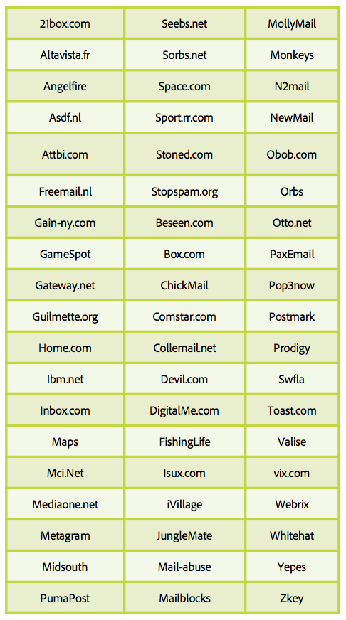

# Todo acerca de las trampas de correo no deseado

Una [trampa de correo no deseado](/help/metrics/spam-traps.md) es una dirección válida, sin mensaje de error cuando se envían correos electrónicos a. Una trampa de correo no deseado tiene una misión principal: identificar a los remitentes de correo no deseado o a los remitentes sin proceso de higiene de los datos.

## ¿Quién administra estas direcciones de trampa de correo no deseado?

El primer tipo de direcciones de trampa de correo no deseado es la compañía de lista de bloqueados de IP y dominio, como SpamHaus, Sorbs, SpamCop. Estas empresas tienen una enorme red de direcciones que se envían en varias páginas de Internet como sitio web, blog, foros para que sus direcciones sean recopiladas por los remitentes de spam.

El segundo tipo de trampa de correo no deseado se basa en las antiguas direcciones activas de ISP. Estos ISP tienen su propia red de trampas de correo no deseado creada en direcciones inactivas reconvertidas en la trampa y cada visita que afecta a la IP del remitente y a la reputación del dominio.

## ¿Cómo funciona?

**Una dirección de correo electrónico sin usuario final**: estas direcciones no tienen ni tendrán nunca un usuario final que pueda registrarse en boletines informativos o en cualquier otro tipo de comunicación.

**Una dirección de correo electrónico abandonada por un usuario**: Tras un período de inactividad, los ISP desactivan las direcciones. Los mensajes de devolución se envían a los remitentes para informarles sobre este nuevo estado. Los remitentes deben insertar estas direcciones en cuarentena o eliminarlas de futuras comunicaciones. Los ISP utilizan estas direcciones transformadas en &quot;trampa de correo no deseado&quot; para monitorizar a los remitentes con prácticas incorrectas.

## ¿Cómo reconocer o identificar una trampa de correo no deseado?

Es un trabajo difícil identificar trampas de correo no deseado. Estas direcciones deben permanecer anónimas, ya que se utilizan para identificar remitentes incorrectos. La mayoría de los ISP no tienen un sistema abierto y de clic para monitorizar las visitas de remitentes incorrectos. Según definiciones anteriores, es posible determinar un pod de direcciones sospechosas y probar la eficiencia de la selección del pod.

## ¿Por qué su base de datos está infectada por trampas de correo no deseado?

La base de datos de direcciones de correo electrónico contiene una trampa de correo no deseado. ¿Cómo es posible? Las dos razones principales son una falta en el proceso de higiene de la base de datos o una disfunción de la colección.

Estos pocos puntos le ayudan a comprobar sus procesos:

* Disfunción de recolección:
   * ¿De dónde provienen sus direcciones de correo electrónico? ¿Cuántas fuentes se utilizan para recopilar estas direcciones? ¿Es usted capaz de identificarlos? ¿Interno/registro?
   * ¿Funciona correctamente su sistema de inclusión?
   * ¿Ha comprobado los dominios y el alias de sus direcciones? ¡Hazlo con la tabla de abajo!
* Proceso de higiene de base de datos:
   * ¿Cuál es su proceso con respecto a la dirección inactiva en los últimos 12 meses?
   * ¿Está procesando una cuarentena de rechazos leves como &quot;usuario inactivo&quot;?
   * ¿Cuándo fue la última vez que cuidó la base de datos e intentó limpiarla? Hágalo con regularidad.

## Alias y dominios que se deben evitar

**Alias**

**Dominios**

