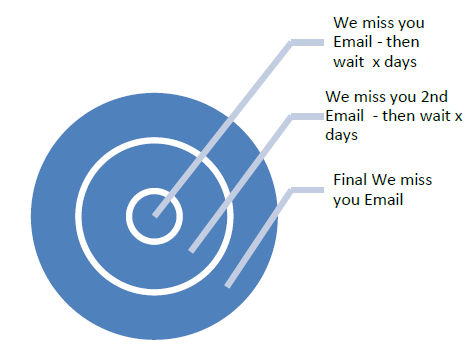

# Prácticas recomendadas para la renovación de participación {#re-engagement}

Al implementar la capacidad de envío, algunas de las prácticas recomendadas consisten en tratar de mantener una base de suscriptores saludable y mejorar la capacidad de envío mediante estrategias de renovación de participación (o recuperación).

* El mantenimiento de una base de suscriptores adecuada es uno de los aspectos principales para asegurar unos envíos correctos y constantes. Muchos problemas de envío surgen como consecuencia de las malas prácticas en relación con los datos y el mantenimiento.
* Uno de los problemas más comunes a los que se enfrentan los especialistas en marketing en la actualidad es la inactividad de los suscriptores (también conocida como baja o sin participación) que puede afectar de forma negativa a las entregas por correo electrónico y suponer una rentabilidad baja.

>[!NOTE]
>
>Para obtener más información sobre estrategias de campañas de renovación de la participación y los servicios de capacidad de envío de Adobe, póngase en contacto con el consultor de capacidad de envío o hable con el agente de ventas de Adobe.

## ¿Cómo ven los ISP la actividad sin participación? {#how-do-isps-view-non-engagement-activity-}

Durante años, los ISP han utilizado métricas de comentarios de participación de sus usuarios para decidir dónde colocar los mensajes o si deben enviarlos siquiera. La [participación](/help/engagement.md) del usuario consiste en comentarios positivos y negativos, y los ISP monitorizan ambos de forma constante. Una actividad sin participación es probablemente una de las principales causas de la participación negativa. Desde la perspectiva de la capacidad de envío, la entrega constante de campañas a usuarios que no muestran ninguna participación puede reducir la reputación general de su dirección IP y sus dominios.

Los ISP como Gmail, Microsoft y OATH consideran la falta de participación como correo electrónico no deseado y empiezan a redirigir los mensajes a la carpeta de correo no deseado. Además, es posible que estos suscriptores ya no sean propietarios de la cuenta de correo electrónico, que puede utilizarse como trampa de correo no deseado &quot;reciclada&quot;. Esto significa que la dirección fue inválida durante un tiempo y que se rechazan todos los mensajes. Si el sistema de administración de suscriptores no elimina las direcciones de &quot;rechazo grave&quot;, es muy probable que envíe a trampas de correo no deseado que puedan provocar problemas de entrega significativos.

## ¿Cómo se debe abordar la inactividad? {#how-should-you-approach-inactivity-}

Los clientes que utilizan la plataforma de Adobe pueden ver la inactividad dentro de su instancia revisando los datos abiertos y haciendo clic en ellos según el segmento. Dado que la falta de participación puede dificultar la entrega, lo primero que se puede hacer es eliminar a los suscriptores de la base de datos. Sin embargo, a veces puede resultar una opción incorrecta. Por lo tanto, una estrategia de renovación de la participación (también conocida como recuperación) es la mejor recomendación para retener a los suscriptores interesados en recibir correo y eliminar gradualmente a aquellos que ya no muestran actividad.

## ¿Las campañas de renovación de la participación realmente funcionan? {#do-re-engagement-campaigns-really-work-}

De acuerdo con un estudio de Return Path, este tipo de campañas dieron como resultado un 12 % de tasa de apertura en comparación con un promedio de 14 % de las campañas normales. Aunque solo el 24 % de los suscriptores había leído la campaña de renovación de la participación, alrededor del 45 % de ellos leyó los mensajes subsiguientes.

## ¿Cómo se crea una campaña de renovación de la participación? {#how-do-you-create-a-re-engagement-campaign-}

### Fase 1 {#phase-1}

* El primer paso es identificar los suscriptores que tienen muy poco o ninguna actividad de apertura o de hacer clic y, segmentar el grupo en función de un intervalo de tiempo determinado. La regla general es revisar los suscriptores que no han abierto o hecho clic en un correo electrónico en los últimos 90 días. Sin embargo, esto varía según la naturaleza del negocio (por ejemplo, envíos estacionales).
* Otro punto a tener en cuenta al definir los marcos de tiempo es que los ISP y las empresas responsables de las listas de bloqueados consideran que la participación dura entre 1,5 y 1,8 años. Además, las actividades de comportamiento como compras y actividad en el sitio web u otros puntos de contacto, como las preferencias durante la fase de registro o el primer punto de contacto.

### Fase 2 {#phase-2}

* Una vez que se define un segmento, el siguiente paso es crear una campaña de participación que se adapte al suscriptor de acuerdo con las métricas que se han identificado. La creación de una línea de asunto ayuda a aumentar el interés del suscriptor. De acuerdo con un estudio de Return Path, las líneas de asunto y el contenido que dicen “Te echamos de menos” generan tasas de respuesta más altas que “Queremos que vuelvas”.
* También se puede ofrecer en el correo electrónico un incentivo por volver a participar. Al considerar las ofertas con descuentos, es mejor utilizar importes de euros en comparación con los porcentajes. Return Path también sugiere hacer esto, ya que incurre en tasas de respuesta más altas. Por último, también resulta útil realizar pruebas divididas A/B para revisar las tasas de respuesta y éxito.

### Fase 3 {#phase-3}

El siguiente paso es determinar la frecuencia de la campaña de renovación de la participación. A diferencia de los mensajes de reconfirmación, estas campañas están pensadas para recuperar al suscriptor con una serie de correos electrónicos a lo largo del tiempo. El ejemplo siguiente proporciona un ejemplo de la frecuencia.

Los suscriptores que se relacionan con la campaña mediante la actividad de apertura o clic se vuelven a añadir a la lista de suscriptores a la que se envió.

### Fase 4 {#phase-4}

* La siguiente fase es identificar a los suscriptores que de forma constante no muestran ninguna actividad y reducir de forma gradual los correos electrónicos que se les envía durante un periodo. Si no hay actividad durante el año anterior, es bueno poner el correo electrónico de los suscriptores en espera. Aunque no hayan mostrado interés en el contenido del correo electrónico, siempre existe una última oportunidad de que vuelvan a activar su suscripción enviando una única campaña de reconfirmación.
* Las campañas de reconfirmación son una buena forma de preguntar a los suscriptores que lleven mucho tiempo inactivos si desean permanecer en la lista de suscripción. Al crear la campaña, es preferible añadir un vínculo de “haga clic aquí” para que puedan confirmar la acción y verificar su dirección. De este modo, la acción se puede registrar en la base de datos. A continuación se muestra un ejemplo de un correo electrónico de reconfirmación:

   

   Una vez que el suscriptor ha realizado una acción, se puede ofrecer una página de destino con la confirmación de su suscripción. A continuación se muestra un ejemplo de página de destino:

   

## Recursos específicos de los productos

**Adobe Campaign**

* [Registros de seguimiento en el Campaign Classic](https://experienceleague.adobe.com/docs/campaign-classic/using/sending-messages/monitoring-deliveries/delivery-dashboard.html#tracking-logs)
* [Registros de seguimiento en el Campaign Standard](https://experienceleague.adobe.com/docs/campaign-standard/using/testing-and-sending/sending-and-tracking-messages/tracking-messages.html#tracking-logs)

**Adobe Administración de Recorridos de Clientes**

* [Seguimiento de mensajes](https://experienceleague.adobe.com/docs/customer-journey-management/using/reporting/message-tracking.html)
