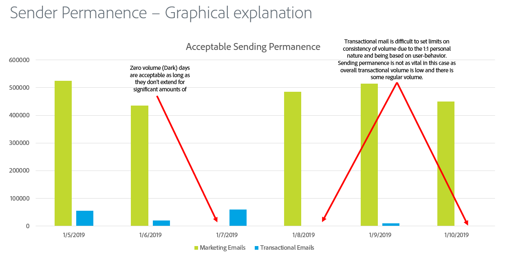

# Permanencia del remitente

La permanencia de envío es el proceso de establecer un volumen de envío y una estrategia coherentes para mantener la reputación del ISP. Estas son algunas razones por las que la permanencia del remitente es importante:

* Los remitentes de spam generalmente &quot;saltan direcciones IP&quot;, lo que significa que cambian constantemente el tráfico en muchas direcciones IP para evitar problemas de reputación.
* La coherencia es clave para probar a los ISP que el remitente es respetable y no intenta evitar ningún problema de reputación que sea resultado de malas prácticas de envío.
* Es necesario mantener estas estrategias coherentes durante un largo periodo de tiempo antes de que algunos ISP consideren siquiera que el remitente tiene la reputación.

**Estos son algunos ejemplos:**

