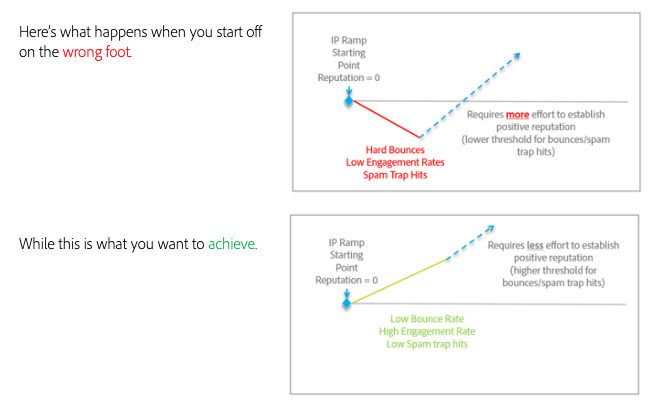

# Cómo realizar la transición sin problemas al cambiar de plataforma de correo electrónico

Al mover proveedores de servicios de correo electrónico (ESP), no es posible realizar también la transición de las direcciones IP establecidas existentes. Es importante que siga las prácticas recomendadas para desarrollar una reputación positiva al volver a empezar. Debido a que las nuevas direcciones IP que va a utilizar aún no tienen reputación, los ISP no pueden confiar plenamente en el correo proveniente de ellas y deben ser cautelosos en lo que permiten que se entregue a sus clientes.

Establecer una reputación positiva es un proceso. Pero una vez que se establezca, los pequeños indicadores negativos tendrán menos impacto en usted y en su envío de correo.

La cantidad de tiempo para calentar sus direcciones IP y dominios puede variar, pero hasta una referencia de ocho semanas es común para que los remitentes típicos establezcan una reputación en la mayoría de los ISP de nivel 1 (Gmail, Microsoft, Verizon/Yahoo/AOL, etc.).

En las siguientes secciones, investigaremos algunas áreas clave en las que centrarnos para incorporarlas correctamente:

1. [Infraestructura](/help/transition-process/infrastructure.md)
2. [Criterios de segmentación](/help/transition-process/targeting-criteria.md)
3. [Consideraciones específicas del ISP durante el calentamiento de la IP](/help/transition-process/isp-specific-considerations-during-ip-warming.md)
4. [Volumen](/help/transition-process/volume.md)
