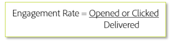

# Criterios de segmentación

Al enviar nuevo tráfico, solo se dirige a los usuarios con mayor participación durante las fases iniciales del calentamiento de la IP. Esto ayuda a establecer una reputación positiva desde el principio para generar confianza de forma eficaz antes de llegar a sus audiencias menos comprometidas. Esta es una fórmula básica para la participación:

Normalmente, una tasa de participación se basa en un período de tiempo específico. Esta métrica puede variar drásticamente en función de si la fórmula se aplica en un nivel general o para tipos de correo o campañas específicos. Los criterios de objetivo específicos deben proporcionarse trabajando con su consultor de capacidad de envío de Adobe, ya que cada remitente e ISP varía y generalmente requiere un plan personalizado.

## Recursos específicos de los productos

**Analytics**

* [Cómo aumentar las tasas de participación y retención (tutorial)](https://experienceleague.adobe.com/docs/analytics-learn/tutorials/mobile-app-analytics/measuring-mobile-analytics/how-to-increase-engagement-and-retention-rates.html?lang=en#mobile-app-analytics): *Identifique las audiencias que interactúan mediante el uso de Cohortes y conozca las causas subyacentes que generan problemas en las aplicaciones móviles. Utilice algoritmos de ciencia de datos en Segment IQ para conocer las diferencias y similitudes entre los segmentos.*

**Campaign Standard**

* [Correos electrónicos con tecnología de IA: puntuación de participación predictiva](https://experienceleague.adobe.com/docs/campaign-standard/using/testing-and-sending/preparing-and-testing-messages/predictive.html#predictive-scoring)
